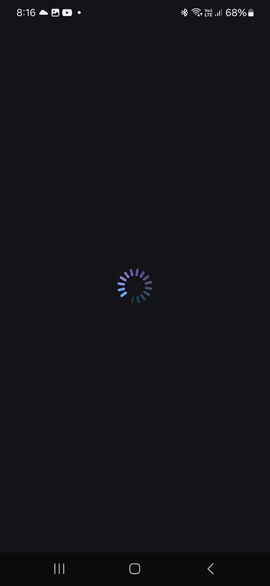
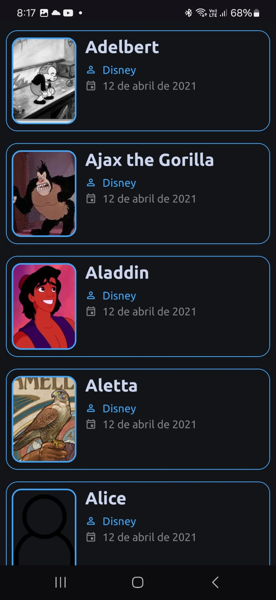
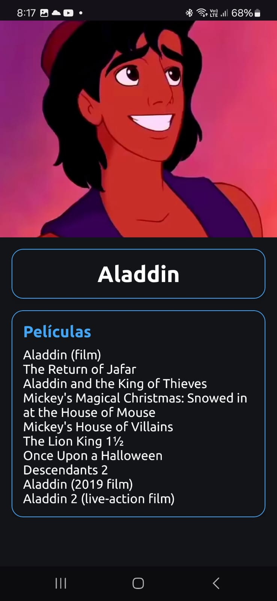
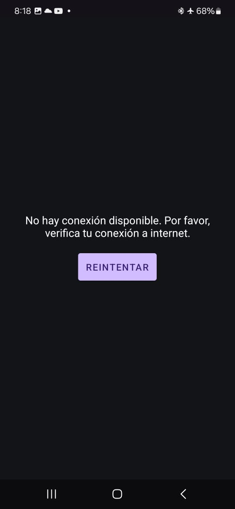

# Disney API Characters App

This application, developed in **Android Studio**, interacts with the **Disney REST API** to display a list of characters and their details.

## Description

The app consists of two main functionalities:

1. **Character List**
   - Retrieves and displays a list of characters from the Disney API:
     - **API Endpoint**: [Get All Characters](https://api.disneyapi.dev/character?pageSize=7438)
   - Each item in the list shows:
     - Character's **image**.
     - Character's **name**.
     - Date of creation of the information

2. **Character Details**
   - When a character is selected, a new screen displays:
     - Character's **name**.
     - Character's **image**.
     - A list of films the character has appeared in.
   - **API Endpoint**: [Get Character Details](https://api.disneyapi.dev/character/id)

### Example
To fetch details for character ID `571`:
```plaintext
https://api.disneyapi.dev/character/571
```

## Preview 

| Loading Screen                            | Characters list                           | Character detailed                        | Error handling                            |
| ----------------------------------------- | ----------------------------------------- | ----------------------------------------- | ----------------------------------------- |
|       |       |       |       |

## Technologies Used
- Language: **Kotlin**
- IDE: **Android Studio**
- Networking: **Retrofit** (to consume REST API).
- Image Loading: **Glide** (for character images).

## Installation
1. Clone this repository:
   ```bash
   git clone https://github.com/ErikGarciaLopez/API-de-Disney.git
   ```
2. Open it in Android Studio.
3. Compile and run it on a device with API >= 24.
